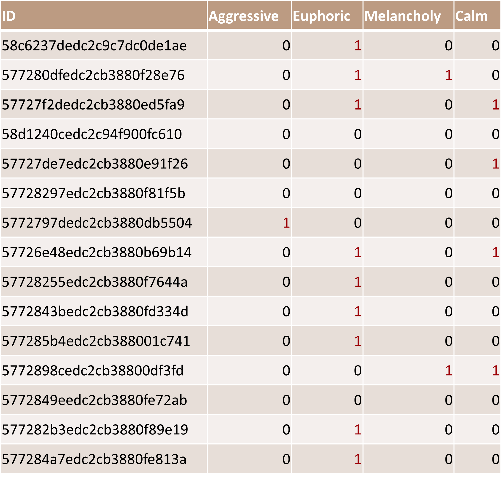
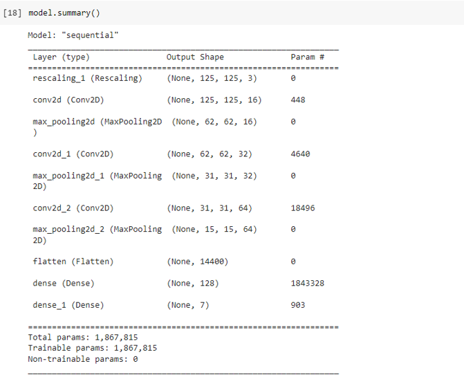
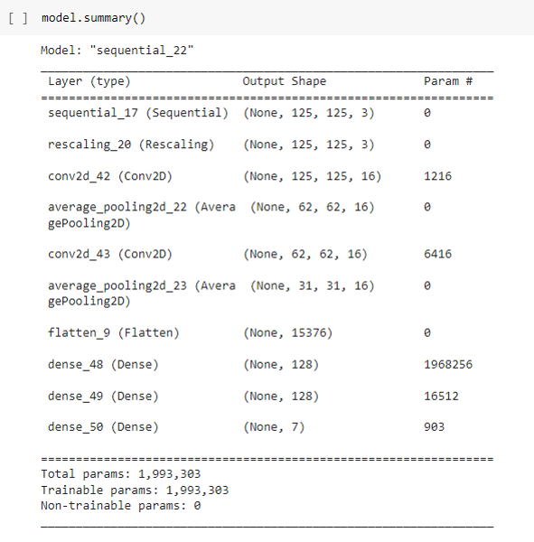
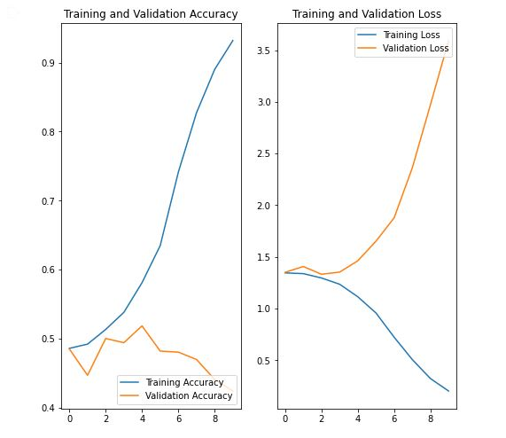
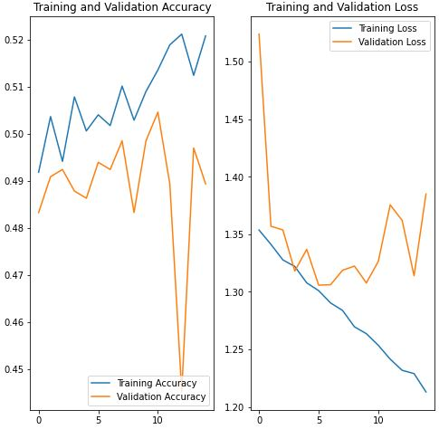
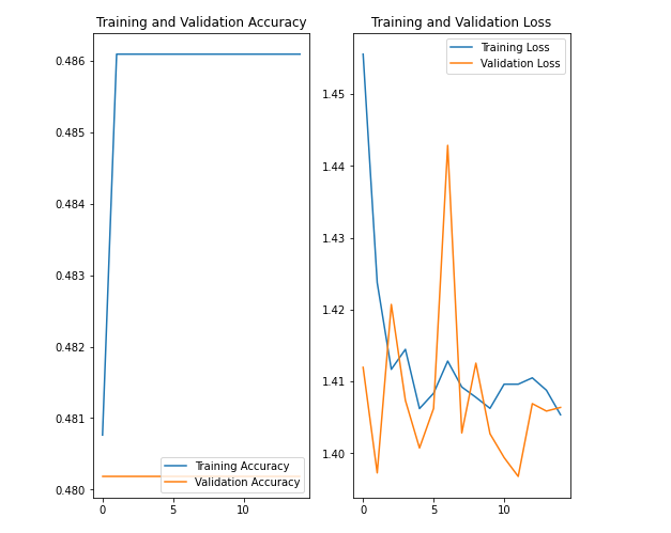
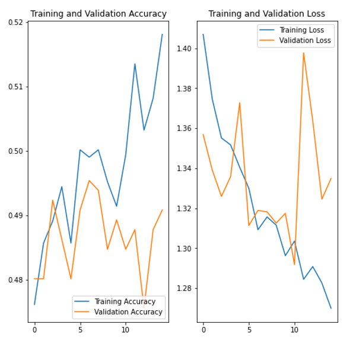
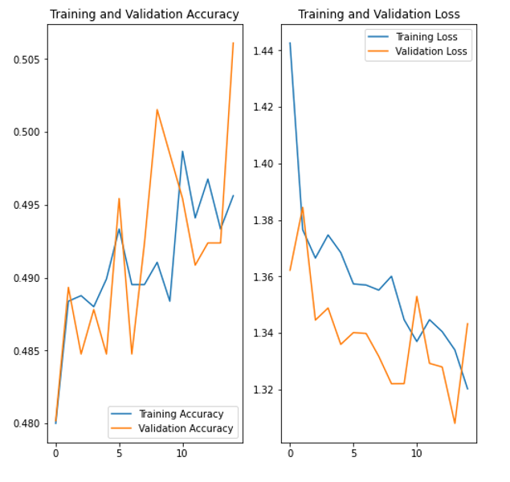

# Emotions in Art
**by Team creAItivity - Nathan Wang and Sakshi Kakkad**

### Introduction
In recent years, developments in digital media technologies as well as easy access to content (through social media platforms and other online sources) require developments in data retrieval and processing tools. Images can be categorized by metadata (keywords or tags) or can be retrieved through content-based image retrieval systems, which classify images based on information contained within the images themselves. However, it is still difficult to retrieve and classify images based on variable, “human” characteristics such as emotion.  

### Problem
We propose to train a machine learning model to classify images based on their associated emotions. The ability to classify images in this way would be useful for social media platforms and image retrieval tools, as it would allow access to more relevant digital media through queries made with “human” parameters rather than empirical ones. Social media platforms and marketing agencies can more accurately display and recommend content for users when algorithms are better trained to interpret data qualitatively.  

### Data Collection
We obtained our dataset from a dataset used by Saif Mohammad in WikiArt Emotions: An Annotated Dataset of Emotions Evoked by Art. This dataset contains 4,105 images that were categorized by emotions based off surveys from 10 respondents. 

The original dataset contained extra features that were not necessary for our machine learning model. These included style, category, artist, year, etc. The features kept were image ID, emotions present (for simplicity only 3 emotions are shown below), and image url for downloading purposes.

We further sorted the emotions into four categories based on the Reisenzein Mood Model. These categories are Aggressive, Euphoric, Melancholy, and Calm. These labels correspond to the four quadrants of the valence arousal graph of the mood model as depicted below.

The merged dataset is shown below. However, due to the dataset and our merge operations, a large number of datapoints were categorized under multiple classes. For example, Row 2 in the table has a 1 in both the Euphoric and Melancholy categories.

We decided to create separate classes for the duplicates, and to limit the number of classes we merged Melancholy with Calm. The final 7 classes were as follows: Euphoric, Aggressive, Calm, Euphoric and Calm (E+C), Aggresive and Calm (A+C), Euphoric and Aggressive (A+E), and all emotions present (A+C+E). After organizing the photos into their respective classes, we downloaded all of the images, resized them into 125x125 pixel RGB images, and saved them in Google Drive. 

The structure of the image allocation was set up as this:

### Methods
For this project, our team decided to use Convolutional Neural Networks (CNNs) for image classification. The code was written using Keras with Tensorflow on [Google Colab](https://colab.research.google.com/drive/1RVi2QEySIPyt_gGwJScBd_CXnIL-ghts?usp=sharing). We first gathered the photos from Google Drive and split them into training and testing data (80% was for training and 20% was for testing). We then created a Sequential Model that performed three Convolutions and Max Poolings followed by a Dense function, which resulted in the creation of 1,867,815 total paramaters. We then ran the data through the CNN with 10 epochs.

We used a simple CNN model using Keras Sequential(), as shown below:

We evaluated multiple CNN architectures and fit them to our data. These include modifying our original model to include a Dropout layer, LeNet-5, LeNet-5 with Relu activation, and AlexNet. The model structures are shown below:

Original CNN:

CNN with Dropout:

LeNet-5:

LeNet-5 with Relu:

AlexNet:

### Results
After running the photos through the original CNN code, we generated graphs of accuracy and loss for both the training and testing data.

Based off the current method, while training data seems to result in very high accuracy, the validation accuracy seems to decrease. This indicates that the current Sequential model may be overfitting too much.

We then added a Dropout layer with a rate of 0.2 to reduce overfitting.

While the accuracy of both training and validation both were closer to each other, the overall accuracy dropped for training.

We then implemented existing CNN architectures as discussed above to improve our accuracy and loss. The first model implemented was LeNet-5, which uses 2 convolutional and 3 fully connected layers.

The output shows that this model did not perform as well as the previous CNN models, as training accuracy was lower and loss higher. Additionally, validation accuracy did not increase, nor did loss decrease significantly.

The activation function used in this model was tanh, which produces non-sparse models and can be prone to vanishing/exploding gradients. To counter this, we improved our LeNet-5 model by using Relu as our activation function instead.

This definitely improved our training accuracy and loss, as well as marginally improved validation testing/loss. However, we implemented AlexNet, a deeper CNN that also uses Relu as the activation function in order to improve our validation accuracy and loss.

The AlexNet model demonstrated slightly lower training accuracy and similar loss to LeNet-5 with Relu, but was overall much more consistent with validation training and loss. Overall accuracy was still around 50%, which means our model had a 50-50 chance of predicting the correct emotion classification of an artwork.

### Conclusions

The highest accuracy we were able to achieve with our data was 50%. While our model could not predict the correct classification a majority of the time, we were able to experiment with multiple CNN models to achieve a result that was not extremely overfit. A few takeaways that we made from this project are as follows:

1. Quality and quantity of dataset:

   Having only 4,000 images in our dataset did create a functioning model, but a larger dataset would improve our model significantly. The images were also unevenly distributed    among the classes, with one layer (A + E + C) having only 11 images sorted into that class.

2. Lack of concrete ground truth:

   For an image in our dataset to contain a specific emotion, 40% of survey respondants (of which the total was 10) would have to agree on the emotion. While this was mitigated    by aggregating similar emotions into one of three classes (Aggressive, Euphoric, or Calm), having a larger percentage/sample size would generate a higher quality dataset.
  
   In general, the problem we are trying to solve is inherently abstract. Classifying an image of an animal as a cat or dog, for example, results in a prediction that is            accepted as either true or false. However, not everyone can agree on the ground truth of emotions conveyed in a piece of artwork, as that is dependent on the viewer. The        closest we can get to classifying an abstract concept is by having ground truth labels that are widely accepted, which would mean having more survey respondents.

3. Classification vs. regression:

   We decided to create a classification model rather than regression. This allowed us to reduce the dataset to 3 categories as opposed to the original 20. However, having a        larger number of categories that correspond to the emotions would be more ideal (given a much larger dataset), as it would allow for more sophisticated image retrieval          tools. Additionally, our dataset had overlap between multiple emotions, where it was actually rare that an image was classified as part of one category. A future                consideration could be implementing a regression model as opposed to a classification model. This could potentially increase the accuracy of our model as images would not be    sorted into discrete categories, but instead predicted as a coordinate on the valence-arousal graph we used as a basis for defining our categories.
  

### References
1. [Illustrated: 10 CNN Architectures](https://towardsdatascience.com/illustrated-10-cnn-architectures-95d78ace614d)
2. [Content-based mood classification for photos and music: a generic multi-modal classification framework and evaluation approach](https://dl.acm.org/doi/abs/10.1145/1460096.1460114)
3. [Image Retrieval by Emotional Semantics: A Study of Emotional Space and Feature Extraction](https://ieeexplore.ieee.org/document/4274431)
4. [Visual-Based Emotional Descriptor and Feedback Mechanism for Image Retrieval](https://www.semanticscholar.org/paper/Visual-Based-Emotional-Descriptor-and-Feedback-for-Yoo/1c53645d05e5b5bce6ca87fbe4f20c3397bc1f27)
5. [Building Emotional Machines: Recognizing Image Emotions through Deep Neural Networks](https://arxiv.org/pdf/1705.07543.pdf)
6. [WikiArt Emotions Dataset](http://saifmohammad.com/WebPages/wikiartemotions.html)

### Project Video

