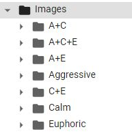
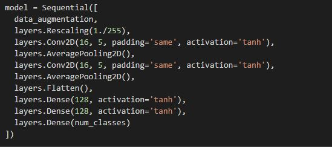

# Art Mood Identifier
**by Team creAItivity - Nathan Wang and Sakshi Kakkad**

### Introduction
In recent years, developments in digital media technologies as well as easy access to content (through social media platforms and other online sources) require developments in data retrieval and processing tools. Images can be categorized by metadata (keywords or tags) or can be retrieved through content-based image retrieval systems, which classify images based on information contained within the images themselves. However, it is still difficult to retrieve and classify images based on variable, “human” characteristics such as emotion.  

### Problem
We propose to train a machine learning model to classify images based on their associated emotions. The ability to classify images in this way would be useful for social media platforms and image retrieval tools, as it would allow access to more relevant digital media through queries made with “human” parameters rather than empirical ones. Social media platforms and marketing agencies can more accurately display and recommend content for users when algorithms are better trained to interpret data qualitatively.  

### Data Collection
We obtained our dataset from a dataset used by Saif Mohammad in WikiArt Emotions: An Annotated Dataset of Emotions Evoked by Art. This dataset contains 4,105 images that were categorized into emotions based off surveys. For our project, we compiled these images under 7 classes: Euphoric, Aggressive, Calm, Euphoric and Calm (E+C), Aggresive and Calm (A+C), Euphoric and Aggressive (A+E), and all emotions present (A+C+E). After organizing the photos into their respective classes, we downloaded all of the images, resized them into 125x125 pixel RGB images, and saved them in Google Drive. The structure of the image allocation was set up as this:

### Methods
For this project, our team decided to use Convolutional Neural Networks (CNNs) for image classification. The code was written using Tensorflow on [Google Colab](https://colab.research.google.com/drive/1RVi2QEySIPyt_gGwJScBd_CXnIL-ghts?usp=sharing). We first gathered the photos from Google Drive and split them into training and testing data (80% was for training and 20% was for testing). Following that, we originally created a Sequential Model that performed four Convolutions and Max Poolings followed by a Dense function, which resulted in the creation of 1,867,815 total paramaters. We then ran the data through the CNN with 10 epochs.

The code is shown below:

Afterwards, we also tested using dropout and with commonly used CNN architecture such as LeNet-5, LeNet-5 using Relu, and AlexNet. These architecture were tested with 15 epochs.

LeNet-5 Code:

### Results
After running the photos through the CNN code above, we got these two charts as outputs:

Based off the current method, while training data seems to result in very high accuracy, the validation accuracy seems to decrease. This indicates that the current Sequential model may be overfitting too much.

### Future Considerations
Since our current CNN structure does not perform as well as we desired, we are planning on adjusting the model so that it performs better. One way is to tweak the number of hidden layers and perceptrons. Other potential solutions may include tweaking common CNN network architectures such as AlexNet or VGG-16.

### Future Research Links
1. [Illustrated: 10 CNN Architectures](https://towardsdatascience.com/illustrated-10-cnn-architectures-95d78ace614d)
